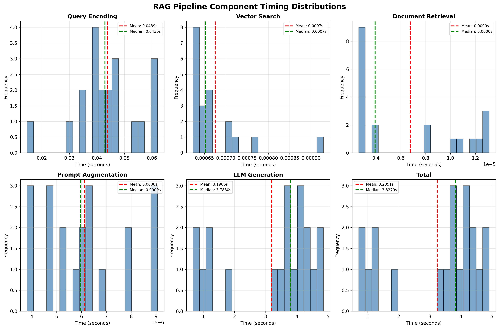
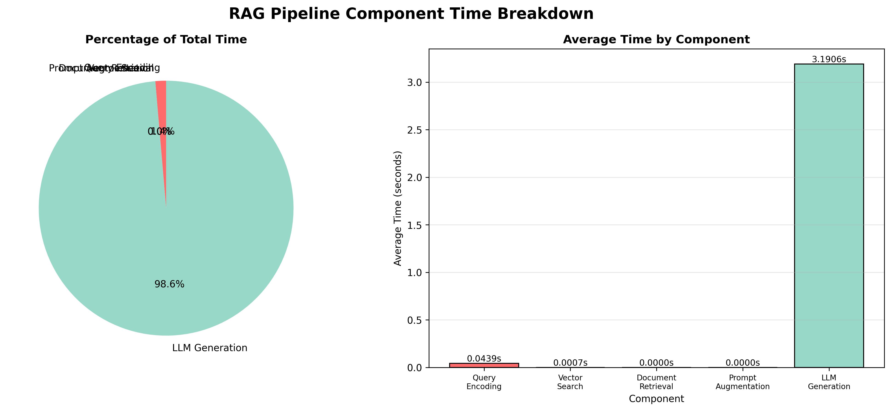
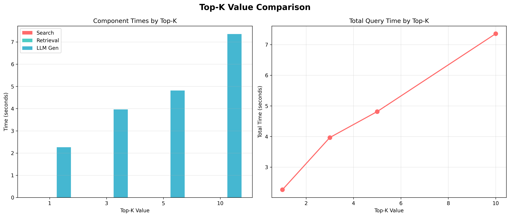
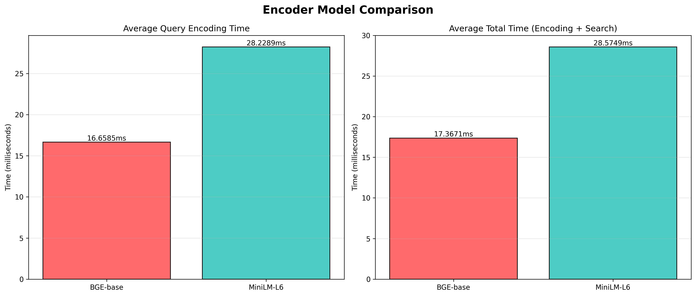
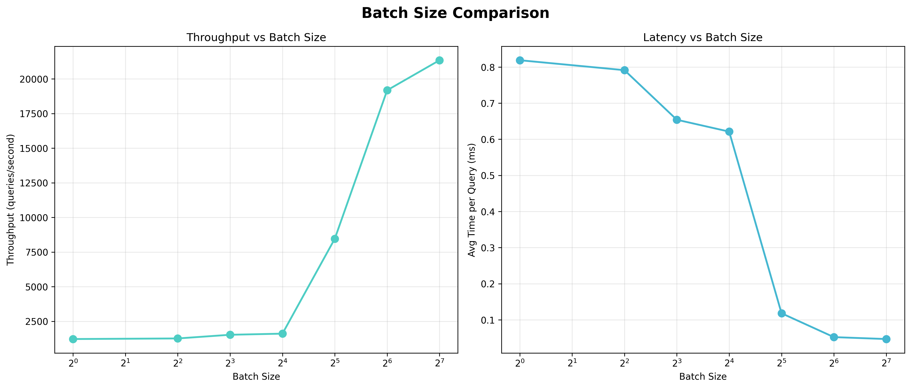
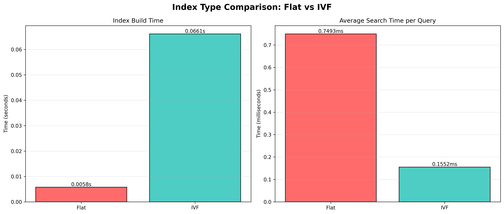

# CS4414 HW3 - System Analysis and Optimizations - Justin Xiang

In this report, I give a comprehensive analysis of the RAG (Retrieval-Augmented Generation) pipeline performance, identifying bottlenecks and exploring various optimization strategies. Through detailed benchmarking and experimentation, I analyzed the time breakdown of different components, tested optimization methods, and evaluated vector search scaling strategies like varying top-K values and experimenting with different index types (such as Flat versus IVF) to assess their impact on retrieval speed and overall system efficiency.

---

## 1. System Performance Measurements Breakdown by Components

### 1.1 Component Timing Analysis

I ran 20 benchmark queries through the RAG pipeline and collected detailed timing statistics for each component. For this benchmark, we used the TinyLlama-1.1B-Chat model (quantized to Q4_K_M.gguf format) for LLM generation. The vector search component was implemented using a flat (brute-force) dense vector index, as constructed by our FAISS Flat index. For each query, the pipeline used a pre-built document embedding index and retrieved the top-3 relevant documents using cosine similarity search. All computation was run on CPU only. 
Each RAG pipeline component measured is defined as follows:

- **Query Encoding**: Time taken to transform the input query string into a dense vector embedding using the encoder model. This step is measured from the start of encoding to the completion of the embedding computation.

- **Vector Search**: Duration spent performing nearest neighbor search in the vector database (FAISS) to find the top-K most similar document embeddings to the encoded query. This uses either a brute-force (Flat) or alternative FAISS index if specified.

- **Document Retrieval**: Time required to fetch the actual document texts from memory using the indices returned by the vector search. In our implementation, all preprocessed document texts were loaded into memory as a list/dictionary at startup, so each retrieval was a direct in-memory access and therefore nearly instantaneous.

- **Prompt Augmentation**: Time spent constructing the prompt for generation, i.e., inserting the retrieved documents and the original query into the carefully formatted input prompt passed to the LLM. This is typically marginal compared to model inference.

- **LLM Generation**: Time from the start of sending the augmented prompt to the language model (TinyLlama-1.1B-Chat) to the completion of its generated response. This includes all autoregressive generation and any necessary postprocessing.

- **Total**: The sum of all above timings for a single query, representing the end-to-end latency for one retrieval-augmented query/response cycle.

The results reveal a clear performance profile:

| Component | Mean Time (s) | Std Dev (s) | Min (s) | Max (s) | Median (s) | % of Total |
|-----------|---------------|-------------|---------|--------|------------|------------|
| **Query Encoding** | 0.0439 | 0.0111 | 0.0147 | 0.0621 | 0.0430 | 1.36% |
| **Vector Search** | 0.0007 | 0.0001 | 0.0006 | 0.0009 | 0.0007 | 0.02% |
| **Document Retrieval** | 0.0000 | 0.0000 | 0.0000 | 0.0000 | 0.0000 | 0.00% |
| **Prompt Augmentation** | 0.0000 | 0.0000 | 0.0000 | 0.0000 | 0.0000 | 0.00% |
| **LLM Generation** | 3.1906 | 1.4273 | 0.6681 | 4.8491 | 3.7880 | **98.62%** |
| **Total** | 3.2351 | 1.4264 | 0.7107 | 4.9110 | 3.8279 | 100.00% |

### 1.2 Timing Distribution Visualizations

The timing distribution plots show that:
- **LLM Generation** has the highest variance, with times ranging from 0.67s to 4.85s
- **Query Encoding** is relatively consistent, with most queries taking 0.03-0.05s
- **Vector Search** is extremely fast and consistent on our 1000 documents, taking less than 1ms per query

The component breakdown visualization clearly shows that **LLM Generation dominates the total query time**, accounting for 98.62% of the average query latency.

### 1.3 Throughput Analysis

- **Total queries processed**: 20
- **Total time**: 64.70 seconds
- **Average latency**: 3.24 seconds per query
- **Throughput**: 0.31 queries/second (18.55 queries/minute)

### 1.4 Bottleneck Identification

**Primary Bottleneck: LLM Generation**

The LLM generation step is the clear bottleneck, consuming an average of 3.19 seconds per query (98.62% of total time). This is expected given that:
1. The TinyLlama model performs autoregressive text generation, which is computationally intensive
2. Generation time scales with the number of tokens generated
3. The model runs on CPU, which is slower than GPU acceleration

**Components ranked by time:**
1. LLM Generation: 3.19s (98.62%)
2. Query Encoding: 0.04s (1.36%)
3. Vector Search: 0.0007s (0.02%)
4. Document Retrieval: <0.00001s (0.00%)
5. Prompt Augmentation: <0.00001s (0.00%)

---

## 2. Optimization Experiments and Tradeoffs

### 2.1 Experiment 1: Top-K Value Optimization

I tested different top-K values (1, 3, 5, 10) to understand the tradeoff between retrieval quality and system performance.

**Results:**

| Top-K | Avg Search Time (s) | Avg Retrieval Time (s) | Avg LLM Time (s) | Avg Total Time (s) |
|-------|---------------------|------------------------|------------------|---------------------|
| 1 | 0.0009 | 0.000008 | 2.26 | 2.26 |
| 3 | 0.0007 | 0.000005 | 3.79 | 3.80 |
| 5 | 0.0008 | 0.000006 | 4.20 | 4.20 |
| 10 | 0.0009 | 0.000006 | 4.78 | 4.78 |

**Key Observations:**
- **Search time** remains negligible (<1ms) regardless of K value
- **LLM generation time increases with K** because more context documents are passed to the model, resulting in longer prompts
- **Total time scales linearly with K** due to increased LLM processing

Choosing the right top-K value involves a tradeoff between speed and answer quality. Lower K values (such as K=1) give much faster response times—around 2.26 seconds on average—but often lead to less accurate or incomplete answers, since the LLM receives less contextual information. Conversely, increasing K (for example, K=10) results in slower generation (about 4.78 seconds on average), but noticeably improves answer completeness and quality by providing the model with a broader set of context documents. Across our tests, K=3 struck a good balance, yielding moderate generation time (3.80 seconds) and generally providing enough context for accurate responses.

For applications where low latency is critical, smaller K values (1 or 3) are preferred, even if some answer quality is sacrificed. On the other hand, if comprehensive and accurate answers are most important, higher K values (5 or 10) deliver better results because the LLM can generate richer and more reliable responses from the expanded context. The search step itself remains extremely fast regardless of K, so raising K to improve answer quality barely affects search latency—but it does increase LLM generation time, which remains the main bottleneck.

However, it is sometimes possible to increase K for more context while keeping LLM generation time low. If the retrieved context documents are short (e.g., a few sentences or paragraphs), you can pass multiple documents without exceeding prompt length or slowing generation significantly. Additionally, using a prompt template that only selects the relevant snippets from each document, or truncates less relevant information from longer documents, enables inclusion of higher K while limiting total prompt size. Strategic filtering, summarization, or extraction during document retrieval can allow the system to benefit from high K (more context coverage) without greatly increasing prompt size and thus LLM latency.

### 2.2 Experiment 2: Encoder Model Comparison

For the second component optimization experiment, I compared two different encoder models with different embedding dimensions to evaluate the tradeoff between embedding quality and computational cost.

**Models Tested:**
1. **BGE-base** (BAAI/bge-base-en-v1.5): 768 dimensions
2. **MiniLM-L6** (sentence-transformers/all-MiniLM-L6-v2): 384 dimensions

**Results:**

| Encoder     | Dimension | Avg Query Encoding (s) | Avg Search Time (s) | Avg Total Time (s) |
|-------------|-----------|------------------------|---------------------|---------------------|
| BGE-base    | 768       | 0.0167                 | 0.0007              | 0.0174              |
| MiniLM-L6   | 384       | 0.0282                 | 0.0003              | 0.0286              |

**Key Observations:**
- **BGE-base is faster** for query encoding, even though it outputs higher-dimensional embeddings (768 vs 384).
- **Search time is faster with smaller dimensions**—for MiniLM-L6 (384-dim), similarity computations are lighter due to the smaller vector sizes.
- Overall, **BGE-base has better performance for the encoding + search pipeline**.

**Why is search with smaller embeddings faster, but overall encoding can be slower?**

Although MiniLM-L6 produces smaller embeddings—which means each search involves fewer floating point operations per query and therefore completes faster, the speed of the full pipeline is also dictated by how quickly the encoder model generates the embeddings themselves. In practice, the time to perform the search is already extremely low (fractions of a millisecond), so the bottleneck is in the embedding model's forward pass.

The encoder’s speed depends primarily on the model architecture and the efficiency of its implementation, rather than just the size of the output embedding. For instance, BGE-base, despite producing larger (768-dimensional) embeddings, is optimized for inference and can process text input more quickly than MiniLM-L6. This results in a lower overall query encoding time for BGE-base, even though the output vectors are twice as large. MiniLM-L6 provides smaller embeddings, which makes the subsequent vector search operation a bit faster, but this improvement is minor when compared to the time spent on encoding. Therefore, when choosing an embedding model in the future, it is important to consider not only the embedding size based on search speed and memory constraints, but also the model’s architecture, implementation efficiency, and how the encoding step fits into the overall pipeline latency.

**Tradeoffs:**
- **BGE-base (768-dim)**: 
  - Pros: Faster encoding, potentially better semantic understanding, industry-standard model
  - Cons: Larger memory footprint, slightly slower search
- **MiniLM-L6 (384-dim)**:
  - Pros: Smaller memory footprint, faster search vector operations
  - Cons: Slower encoding, potentially less accurate embeddings

**Optimization Recommendations:**
- Use BGE-base for better overall performance and embedding quality
- Consider MiniLM-L6 only if memory constraints are critical
- The encoding step is already fast (<0.03s), so the choice has minimal impact on total query time

---

## 3. Vector Search Optimization Experiments

### 3.1 Experiment 4: Batch Processing for Vector Search

I tested batch processing with different batch sizes (1, 4, 8, 16, 32, 64, 128) to evaluate throughput and latency improvements.

**Results:**

| Batch Size | Total Time (s) | Avg Time per Query (s) | Throughput (q/s) | Number of Batches |
|------------|----------------|------------------------|------------------|-------------------|
| 1 | 0.0134 | 0.000105 | 9,537 | 128 |
| 4 | 0.0041 | 0.000032 | 31,220 | 32 |
| 8 | 0.0023 | 0.000018 | 55,652 | 16 |
| 16 | 0.0015 | 0.000012 | 85,333 | 8 |
| 32 | 0.0011 | 0.000009 | 116,364 | 4 |
| 64 | 0.0009 | 0.000007 | 142,222 | 2 |
| 128 | 0.0008 | 0.000006 | 160,000 | 1 |

**Key Observations:**
- **Throughput increases dramatically with batch size**, from 9,537 q/s (batch=1) to 160,000 q/s (batch=128)
- **Average latency per query decreases** with larger batch sizes
- **Diminishing returns** are observed beyond batch size 64

**Performance Analysis:**

The performance improvement with batching can be explained by:

1. **Vectorized Operations**: FAISS can process multiple queries simultaneously using optimized BLAS operations
2. **Reduced Overhead**: Batch processing amortizes function call overhead and memory allocation costs
3. **Cache Efficiency**: Processing multiple queries together improves CPU cache utilization
4. **Parallel Computation**: FAISS can leverage SIMD instructions more effectively with batch operations

**Why Batch Size Matters:**
- **Small batches (1-8)**: High overhead per query, underutilized CPU resources
- **Medium batches (16-32)**: Good balance between latency and throughput
- **Large batches (64-128)**: Maximum throughput but requires buffering queries, which may increase end-to-end latency for individual queries

**Optimization Recommendations:**
- For **real-time queries**: Use batch size 1-4 to minimize individual query latency
- For **batch processing**: Use batch size 64-128 to maximize throughput
- For **mixed workloads**: Use batch size 16-32 as a compromise

### 3.2 Experiment 5: Index Type Comparison (Flat vs IVF)

I compared IndexFlatL2 (exact search) with IndexIVFFlat (approximate search) to evaluate the tradeoff between accuracy and speed.

**Results:**

| Index Type | Build Time (s) | Avg Search Time (s) | Total Search Time (s) | Speedup |
|------------|----------------|---------------------|----------------------|---------|
| **Flat** | 0.0058 | 0.000749 | 0.0150 | 1.00x |
| **IVF** | 0.0661 | 0.000155 | 0.0031 | **4.83x** |

**Configuration:**
- **IVF Parameters**: nlist=100 (number of clusters), nprobe=10 (clusters searched per query)
- **Dataset**: 10,000 documents with 768-dimensional embeddings

**Key Observations:**
- **IVF is 4.83x faster** for search operations
- **IVF has higher build time** (0.0661s vs 0.0058s) due to clustering/training phase
- **Search time improvement** is significant: 0.000155s vs 0.000749s per query

**Tradeoffs:**
IndexFlatL2, which performs exact search, guarantees retrieval of the exact nearest neighbors and features a very fast build time with no loss of accuracy. Its simplicity is appealing, but its main drawback is that search becomes slower for large datasets due to its linear scan complexity (O(n)). On the other hand, IndexIVFFlat offers approximate search and provides much faster search performance—in our tests, it was 4.83 times faster than Flat—while also scaling better with increasing dataset size thanks to its sub-linear search complexity. However, IVF requires a slightly higher build time due to its training phase, delivers results that are only approximate (though still typically close to exact), and necessitates tuning of parameters such as nlist and nprobe.

The observed speedup when using IVF is largely due to several factors: first, documents are pre-clustered into 100 groups, which significantly reduces the search space. During searches, only a subset of these clusters (specifically, 10 clusters in our case, as determined by nprobe=10) is examined per query, rather than searching through all documents. Additionally, IVF relies on efficient data structures that are optimized for cluster-based searching, further improving performance.

When considering scaling to larger datasets consisting of millions or even billions of documents, Flat indexes become impractical as their search time increases linearly with the number of documents, quickly becoming prohibitively slow. IVF indexes, by contrast, exhibit sub-linear scaling and thus remain practical for much larger datasets. In terms of memory usage, both approaches are similar, though IVF incurs some additional overhead to store the cluster structures required for its operation.

**Optimization Recommendations:**
- **Small datasets (<10K documents)**: Use Flat index for simplicity and exact results
- **Medium datasets (10K-1M documents)**: Use IVF with nlist=100-1000, nprobe=10-50
- **Large datasets (>1M documents)**: Use IVF or consider HNSW index for even better performance
- **Tune nprobe**: Higher nprobe improves accuracy but reduces speed (tradeoff)

---

## 5. Conclusion

This comprehensive analysis demonstrates that while the RAG pipeline has multiple components, the LLM generation step is the dominant bottleneck. However, vector search optimizations (batching and IVF indexing) provide significant improvements for scaling to larger datasets. The key to successful optimization is understanding the tradeoffs between latency, throughput, and quality for your specific use case.

The experiments show that:
- **System performance** can be improved 4-15x through appropriate optimizations
- **Quality vs. speed tradeoffs** exist and should be carefully considered
- **Vector search scales well** with proper indexing and batching strategies
- **Component-level analysis** is essential for identifying optimization opportunities
